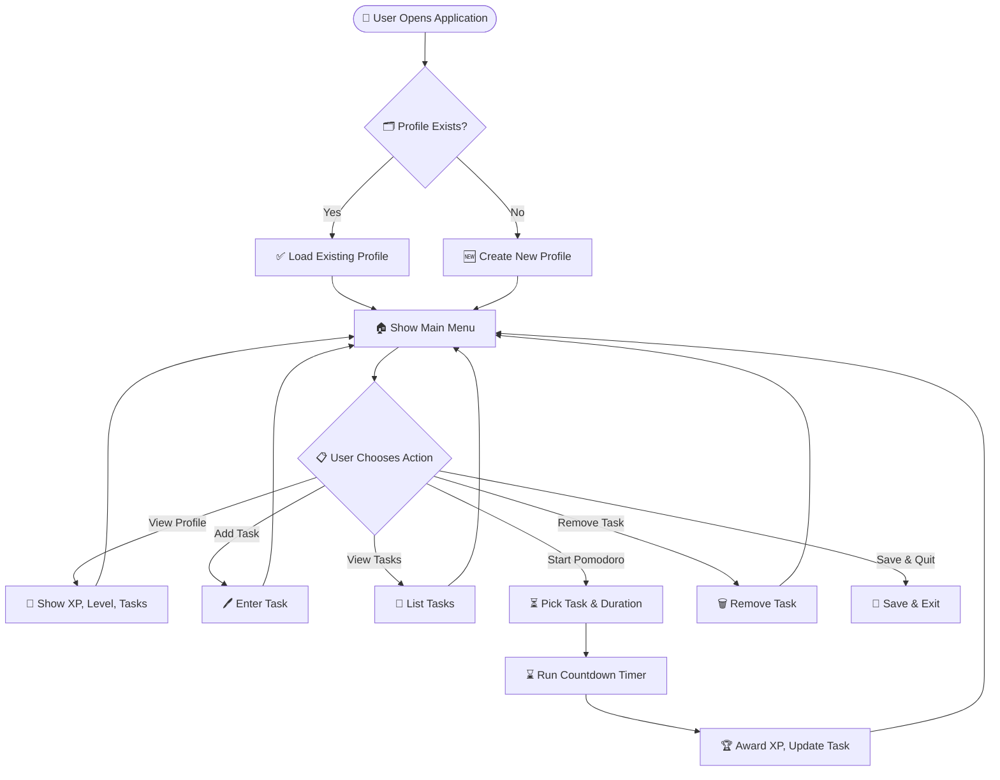

## 🚀 FocusQuest Pomodoro

  

## 💡 What is FocusQuest?

A **Java-based Pomodoro tracker** that helps you boost focus and productivity while practicing clean OOP and file persistence concepts.

**FocusQuest** is a console-based Pomodoro application where you:

 ✏️ **Add tasks** with Pomodoro estimates.  
 ⏱️ **Run Pomodoro sessions** with a countdown timer.  
 🏆 **Gain XP** after each session, gamifying your focus.  
 📈 **Track progress** across sessions.  
 💾 **Persist your profile and tasks** automatically using serialization.

It applies the **Pomodoro Technique (25 min work + 5 min break)** to help you build consistency and attention management while letting you practice **Java file handling, OOP, and Git workflows.**

---

## 📚 Why is it Useful?

 ✅ Builds your focus discipline using structured sprints.  
 ✅ Helps track progress instead of working blindly.  
 ✅ Encourages consistency and productivity gamification.  
 ✅ Lets you practice Java serialization and CLI building practically.

---

## 🗂️ Project Structure

```plaintext
Java_Project1/
├── DataStorage.java
├── FileHandler.java
├── Main.java
├── PomodoroManager.java
├── Task.java
├── UserProfile.java
└── resources/  # (Stores serialized user data)
```
---

## 🛠️ Features

 🎯 Create and load user profiles  
 🗂️ Add, view, and remove tasks  
 ⏱️ Run Pomodoro timers with custom duration (s/m/h)  
 🏆 Earn XP and level up automatically  
 💾 Data persistence using serialization  
 🎨 Clean, colorful CLI for an engaging experience

---

## 📈 Workflow Visualization



## 🚀 Installation

1️⃣ Clone the repository:

```bash
git clone https://github.com/Prasanna-Medisetty/Java_Project1_Pomodoro.git
```
2️⃣ Open in IntelliJ / VS Code with Java 17+ installed.

3️⃣ Run Main.java.

---

## 🤝 Contributing
Pull requests for refactors, feature enhancements, or CLI polish are welcome.

---

## ⭐ Support
If you found this project useful, consider ⭐ starring it on GitHub!

❤️ Happy to take your suggestions to improve and learn together! Feel free to open issues or pull requests if you have ideas to enhance FocusQuest. 
